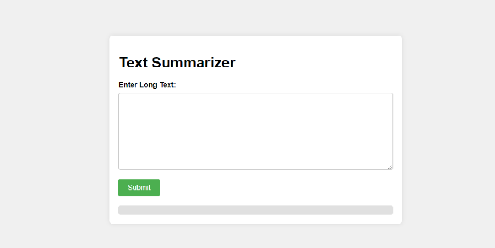
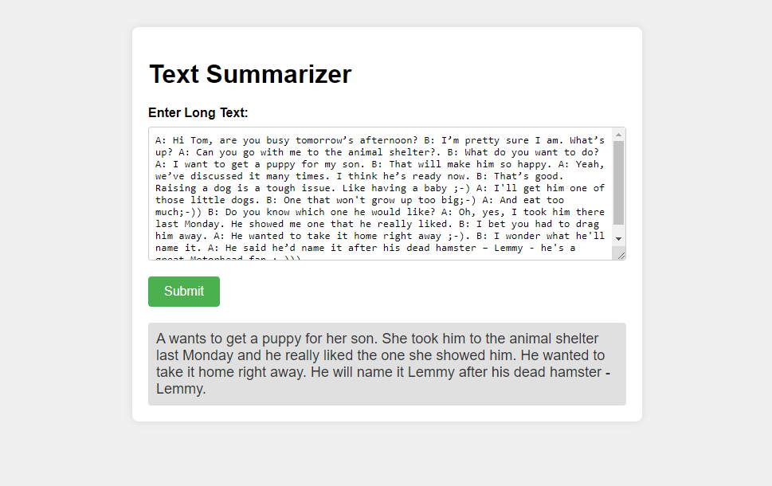
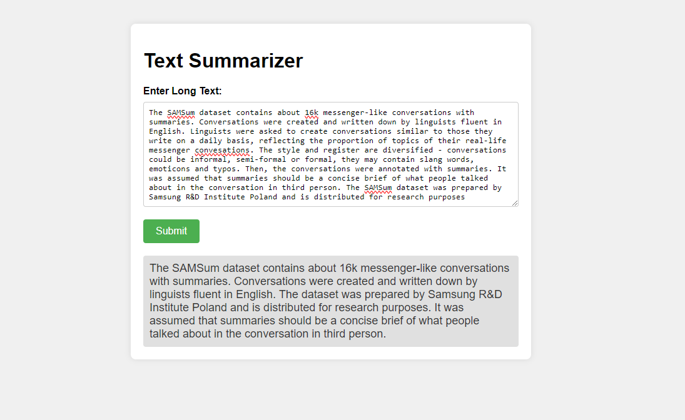

# Text Summarization Project
 

## Overview

This project focuses on text summarization using a Deep Learning approach. It leverages the Hugging Face `transformers` library, specifically the BART (Bidirectional and Auto-Regressive Transformers) model for pre-trained tokenization and fine-tuning. The goal is to generate concise summaries of given input texts.


### Conversation Between Two Person

### Normal Pessage



## Features

- Pre-trained BART model for text summarization
- Fine-tuning capabilities using the Hugging Face `Trainer` and `DataCollatorForSeq2Seq`
- Evaluation with ROUGE metrics
- Integration with Hugging Face Datasets library
- Flask-based web interface for interacting with the summarization model

## Usage
Enter a long text into the input textarea on the web interface.
Click the "Submit" button to generate a summary using the pre-trained BART model.

## ⚠️ Warning
Training the model from scratch is a computationally intensive task and may take a significant amount of time, depending on your hardware capabilities. If you have limited computational resources, consider using the pre-trained model provided in the models directory.

If you choose to train the model, it is recommended to do so on a machine with powerful GPUs or on cloud platforms with GPU support. Additionally, fine-tuning for more epochs may yield better results but will increase the training time.

For quick experimentation or production use, it is advised to use the pre-trained model. Refer to the Usage section for instructions on using the pre-trained model for text summarization.

## Fine-Tuning  
If you have sufficient computational resources, consider fine-tuning the model using the provided Trainer and DataCollatorForSeq2Seq. Refer to the fine-tuning documentation for more details

## Evaluation
To evaluate the model's performance, use the ROUGE metrics. Adjust the evaluation scripts as needed and refer to the Hugging Face datasets documentation for more details.

## Setup

1. **Clone the repository:**

   ```bash
   git clone https://github.com/Ayan7020/text-summarization-project.git
   cd text-summarization-project

2. **Install dependencies:**
   ```bash
   pip install -r requirements.txt

3. **Train The Model:**
   ```bash
   python main.py

4. **Run the Flask application:**
   ```bash
   python app.py  
